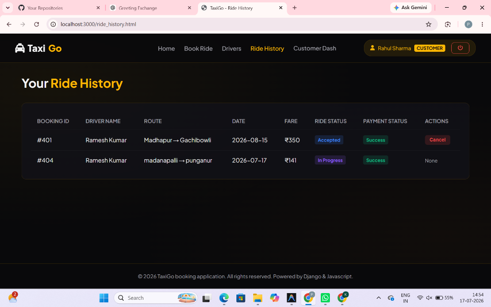
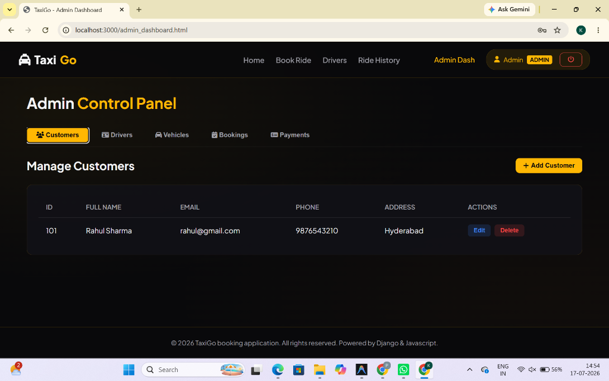
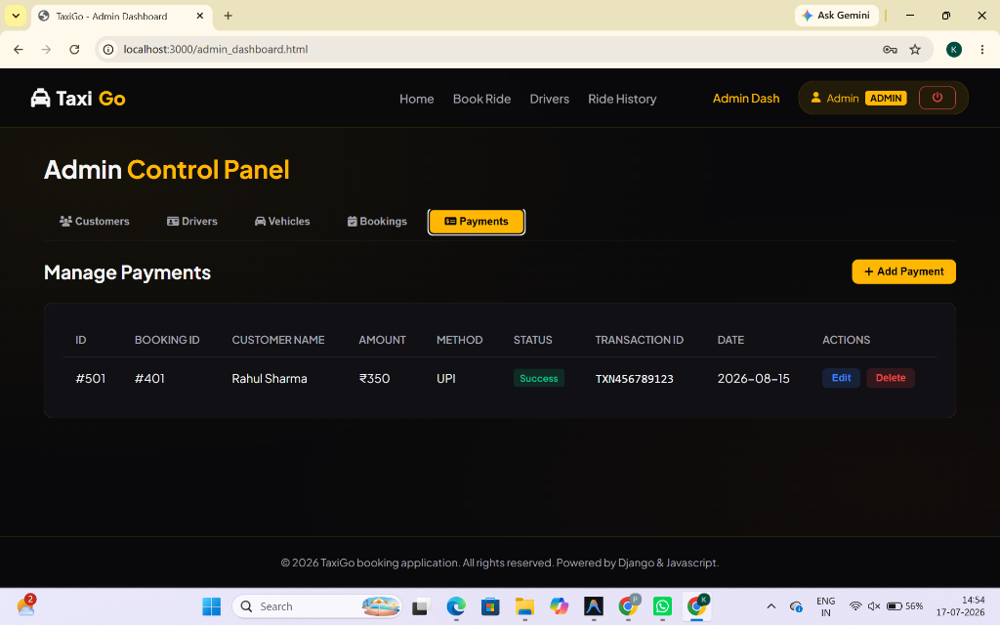
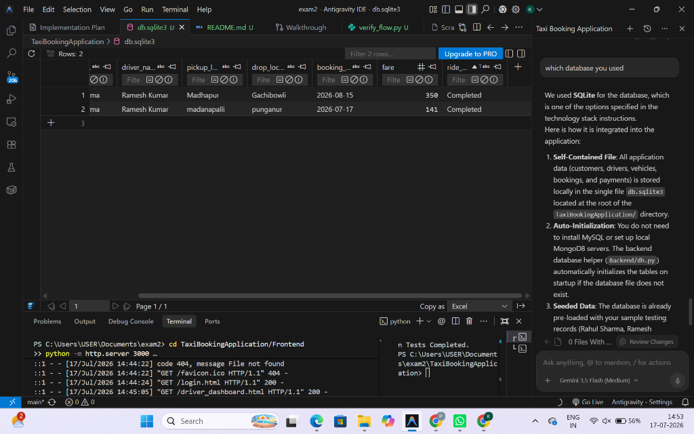
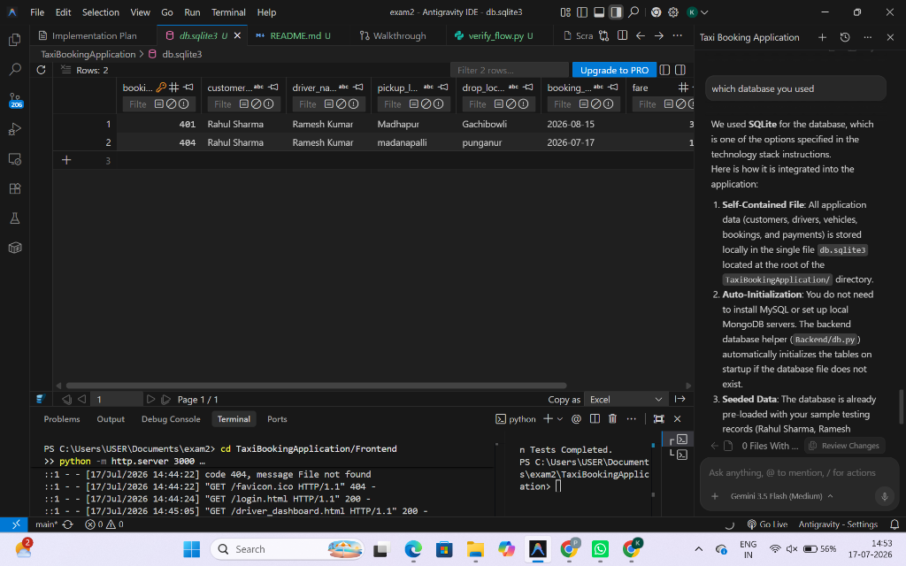

# Taxi Booking Application (TaxiGo)

A complete full-stack web application designed for booking taxi rides, tracking driver availability, making payments, and managing customer and driver dashboards.

## Technology Stack
- **Frontend**: HTML5, CSS3, JavaScript (ES6), Fetch API, FontAwesome.
- **Backend**: Django REST APIs (using Function-Based Views).
- **Database**: SQLite3.

---

## Folder Structure
```
TaxiBookingApplication/
├── Backend/
│   ├── __init__.py
│   ├── asgi.py
│   ├── db.py         # SQLite connection and CRUD methods
│   ├── settings.py   # Django configurations
│   ├── urls.py       # API routing mappings
│   ├── views.py      # 20 Function-Based REST API endpoints
│   └── wsgi.py
├── Frontend/
│   ├── admin_dashboard.html
│   ├── booking.html
│   ├── customer_dashboard.html
│   ├── driver_dashboard.html
│   ├── drivers.html
│   ├── index.html
│   ├── login.html
│   ├── payments.html
│   ├── register.html
│   ├── ride_history.html
│   ├── script.js     # Client state and Fetch API integration
│   └── style.css     # Premium UI theme variables and layouts
├── db.sqlite3        # SQLite Database File
├── manage.py         # Django project manager
├── README.md         # Setup and run instructions
├── seed.py           # Populates initial testing data
├── test_endpoints.py # Tests all 20 APIs
└── verify_flow.py    # Simulates E2E user-driver-checkout flow
```

---

## 20 CRUD REST APIs Implemented

### Customer Management
- `POST` `/customers/add/` : Register a customer account
- `GET` `/customers/` : Retrieve all customer accounts
- `PUT` `/customers/update/<id>/` : Update details of a customer
- `DELETE` `/customers/delete/<id>/` : Delete a customer account

### Driver Management
- `POST` `/drivers/add/` : Add a driver
- `GET` `/drivers/` : Retrieve all drivers
- `PUT` `/drivers/update/<id>/` : Update driver availability status
- `DELETE` `/drivers/delete/<id>/` : Remove driver record

### Vehicle Management
- `POST` `/vehicles/add/` : Associate a vehicle with a driver
- `GET` `/vehicles/` : Retrieve all vehicle details
- `PUT` `/vehicles/update/<id>/` : Edit vehicle details
- `DELETE` `/vehicles/delete/<id>/` : Delete vehicle association

### Ride Booking
- `POST` `/bookings/add/` : Submit booking (auto-assigns available driver)
- `GET` `/bookings/` : Fetch all bookings
- `PUT` `/bookings/update/<id>/` : Update ride status (Requested, Accepted, etc.)
- `DELETE` `/bookings/delete/<id>/` : Cancel/delete booking

### Payment Management
- `POST` `/payments/add/` : Record transaction
- `GET` `/payments/` : Retrieve all transactions
- `PUT` `/payments/update/<id>/` : Update payment status (Success, Pending, Failed)
- `DELETE` `/payments/delete/<id>/` : Delete transaction record

---

## Setup & Running Locally

### 1. Install Dependencies
Make sure Python (3.10+) and Django are installed:
```bash
pip install django djangorestframework django-cors-headers
```

### 2. Start the Backend Server
From the `TaxiBookingApplication/` directory:
```bash
python manage.py runserver 127.0.0.1:8000
```
*Note: The SQLite database file (`db.sqlite3`) and all tables auto-initialize on launch.*

### 3. Seed Sample Data
Open a separate terminal window and run:
```bash
python seed.py
```
This seeds the initial test data:
- Customer: Rahul Sharma (`customer_id: 101`, password: `rahul123`)
- Driver: Ramesh Kumar (`driver_id: 201`, password: `driver123`)
- Vehicle: Hyundai Verna (`vehicle_id: 301`)
- Booking: Madhapur to Gachibowli (`booking_id: 401`)
- Payment: ₹350 UPI (`payment_id: 501`)

### 4. Open the Frontend Application
Double-click `Frontend/index.html` to open it in your web browser, or launch a quick HTTP server:
```bash
cd Frontend
python -m http.server 3000
```
Navigate to `http://localhost:3000`.

---

## Testing Credentials
- **Customer**: Email: `rahul@gmail.com` | Password: `rahul123`
- **Driver**: Email: `ramesh@gmail.com` | Password: `driver123`
- **Admin**: Email: `admin@taxigo.com` | Password: `admin123`

---

## Running Verification Tests
To run the automated tests verifying all 20 API routes:
```bash
python test_endpoints.py
```
To run the E2E passenger-driver ride workflow simulation:
```bash
python verify_flow.py
```

---

## Application Preview & Database Screenshots

### 1. Customer Ride History Page


### 2. Admin Control Panel - Customers Management


### 3. Admin Control Panel - Payments Management


### 4. SQLite Database Tables (db.sqlite3)
*Bookings Table:*


*Trip logs:*


